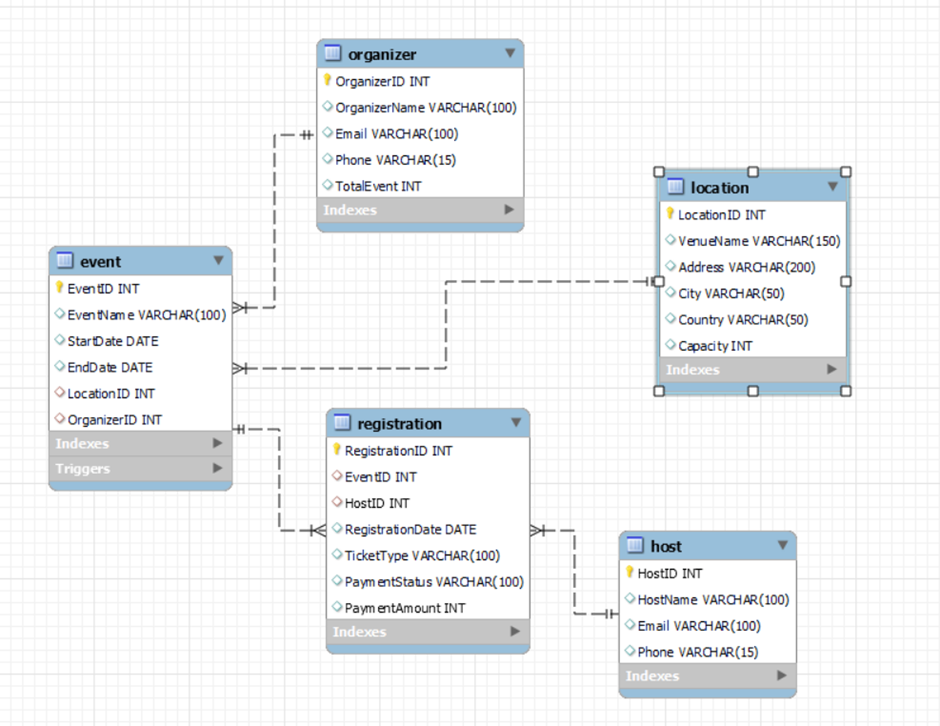

# Event Management System Database

The Event Management System database is designed to efficiently manage various aspects of organizing events, including locations, organizers, hosts, events themselves, and registrations. It aims to provide a structured approach to handling event-related data, ensuring integrity and coherence throughout the system.

## Database Structure

The database comprises several tables:

1. **Location**: Stores details about event locations, such as venue name, address, city, country, and capacity.
2. **Organizer**: Manages information about event organizers, including their name, email, phone, and the total number of events organized.
3. **Host**: Contains details of event hosts, including their name, email, and phone number.
4. **Event**: Tracks event specifics like event name, start and end dates, location ID, and organizer ID. Foreign key constraints link events to their respective locations and organizers.
5. **Registration**: Stores registration details for events, including registration ID, event ID, host ID, registration date, ticket type, payment status, and payment amount. Foreign key constraints ensure data integrity by linking registrations to events and hosts.

## Key Features

1. **Data Integrity**:
   - Foreign key constraints maintain referential integrity between related tables, preventing inconsistencies in the data.
2. **Data Consistency**:
   - The database design adheres to normalization principles, minimizing redundancy and ensuring data consistency.
3. **Relational Structure**:
   - Relationships between entities are established using foreign key constraints, facilitating efficient data retrieval and management.
4. **Transaction Support**:
   - The database supports transactions, ensuring atomicity and consistency of operations.
5. **Scalability**:
   - The modular design allows for easy scalability, enabling the addition of new features or entities without disrupting existing functionalities.
6. **Automation through Triggers and Procedures**:
   - Triggers and procedures automate certain actions, such as updating the total number of events for an organizer after event insertion and registering for events, enhancing system efficiency.

## Entity-Relationship Diagram (ERD)

## Conclusion

The Event Management System database provides a robust framework for managing events, organizers, hosts, and registrations. With its well-structured design and key features, it offers an efficient and effective solution for event management.

---

*The Event Management System (EMS) is a well-crafted and comprehensive database project designed to serve as the backbone for efficiently managing and operating events. By carefully incorporating key features and principles of database design, this project addresses the multifaceted requirements of event management, covering aspects such as event organization, participant registration, venue management, and coordinator coordination.*

*The structured organization of the database, featuring tables such as Events, Locations, Organizers, and Registrations, reflects a strong adherence to normalization principles. This not only reduces data redundancy but also ensures data consistency and integrity. The utilization of foreign key constraints establishes robust relationships between entities, enhancing accuracy and preventing data anomalies.*

*The relational architecture of the database facilitates seamless data retrieval through JOIN operations, enabling the generation of insightful reports that encompass various aspects of event management. This functionality is essential for informed decision-making and strategic planning.*

*Moreover, the inclusion of triggers and stored procedures automates several system tasks, contributing to operational efficiency. For example, the trigger for updating the total event count for an organizer upon the insertion of a new event showcases the system's capability to maintain real-time event management data.*

*The project also demonstrates foresight by anticipating future scalability requirements. Its modular design allows for the straightforward addition of new features or entities as the event management business expands or evolves. The inclusion of components such as host and registration management positions the system to effectively handle the intricacies of event organization and coordination.*

*By adopting a structured and relational approach, the Event Management System provides a robust solution for current event management needs while offering a flexible framework that can adapt to future requirements. The meticulous consideration of data security, transaction management, and support for constraints enhances the overall reliability and trustworthiness of the system.*

*In conclusion, the Event Management System database project showcases a thoughtful integration of database design principles with a focus on meeting the practical demands of event management. It establishes a solid foundation for a scalable, secure, and efficient information system that can enhance the day-to-day operations and decision-making processes within an event management business.*
